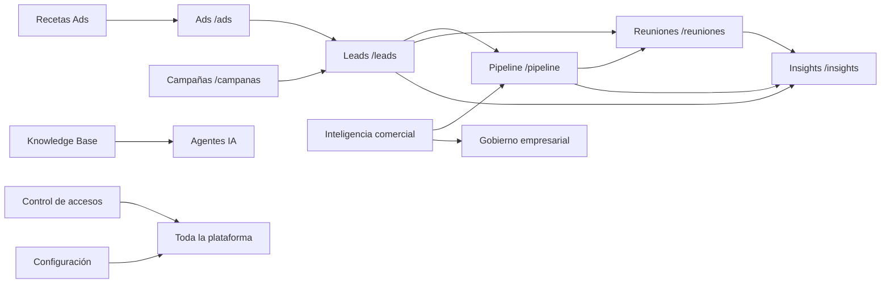

# Ventas y Sistema: guía funcional detallada por página

## 1. Alcance y forma de leer esta guía

Este documento describe las diez pantallas que aparecen en los grupos `Ventas` y `Sistema` de la sidebar. Está escrito para una persona que conoce procesos comerciales y de plataforma, pero que no ha visto VozIA antes.

La descripción se ha contrastado con:

- `src/components/Sidebar.jsx` y `src/App.jsx` para navegación y rutas.
- Los componentes y páginas React de cada pantalla.
- `backend/src/controllers`, `backend/src/services` y `backend/src/routes`.
- `backend/prisma/schema.prisma` para entidades, relaciones, estados e índices.
- `src/lib/navigationPermissions.js`, `ProtectedRoute.jsx` y `AdminRoute.jsx` para visibilidad y protección de UI.

### 1.1. Reglas transversales

Todas las páginas protegidas cuelgan de `ProtectedRoute`. Si no hay sesión, la aplicación redirige a `/login`; si la sesión se está restaurando, muestra un estado de espera. La sidebar se filtra en el navegador con permisos de lectura, pero el servidor vuelve a comprobar cada operación.

El backend identifica la organización mediante `orgId` del JWT. Los servicios deben consultar y mutar siempre dentro de ese `orgId`; el frontend no puede ampliar ese alcance enviando otro identificador.

Las rutas de backend se registran bajo `/api`. Salvo indicación expresa, las respuestas de listado pueden venir como array o como objeto paginado con `data`, `total` y `totalPages`; los componentes normalizan ambas formas.

En esta guía:

- **Lectura** significa consultar datos.
- **Mutación** significa crear, actualizar, mover, completar, aprobar o eliminar/desactivar.
- **Scope** es el alcance autorizado por el servidor: `own` (propios), `team` (equipo) u `org` (organización).
- **Parcial** significa que existe la pantalla o el contrato, pero alguna acción es sólo visual, está sin endpoint o depende de datos que todavía no llegan de una fuente real.

### 1.2. Ubicación en la plataforma

| Grupo | Página | Ruta principal |
|---|---|---|
| Ventas | Leads | `/leads` |
| Ventas | Pipeline | `/pipeline` |
| Ventas | Reuniones | `/reuniones` |
| Ventas | Inteligencia comercial | `/inteligencia-comercial` |
| Sistema | Insights | `/insights` |
| Sistema | Knowledge Base | `/knowledge-base` |
| Sistema | Configuración | `/configuracion` |
| Sistema | Gobierno empresarial | `/gobierno-empresarial` |
| Sistema | Control de accesos | `/access-control` |
| Sistema | Recetas Ads | `/admin/ad-playbooks` |

Rutas de detalle conectadas con estas pantallas:

- `/leads/:id` — ficha individual del lead.
- `/pipeline/:id` — ficha individual de la oportunidad.
- `/reuniones/:id` — detalle y preparación de una reunión.
- `/knowledge-base/articulos/:id` — artículo individual.
- `/campanas/:id` — detalle de campaña, que relaciona adquisición, leads, reuniones y Ads.

---

## 2. Ventas

### 2.1. Leads

#### Propósito y problema que resuelve

Es la bandeja operativa del equipo comercial. Resuelve el problema de tener contactos dispersos y no saber a quién contactar, en qué estado está cada persona, cuánto valor potencial representa o cuál es la siguiente acción.

La página no es sólo un directorio: combina priorización, filtrado, seguimiento, importación y acceso a la ficha completa del lead. El criterio de prioridad usa el score y los datos que ya existen; no debería inventar actividad o tendencias cuando el backend no las entrega.

#### Usuarios y momento de uso

- **Comercial (`sales_rep`)**: trabaja su cartera propia, cambia estados, registra notas y contacta.
- **Responsable de ventas (`sales_manager`)**: revisa la cartera del equipo, reasigna o supervisa leads y exporta conjuntos.
- **Revenue Ops (`revenue_ops`)**: importa, corrige datos, audita webs y opera integraciones.
- **Marketing/Growth**: consulta origen, campaña y calidad de captación.
- **Compliance**: consulta consentimiento, actividad y auditoría.
- **Analista**: no tiene acceso por defecto al módulo de leads en el catálogo actual, aunque puede recibir datos agregados en Insights.

#### Ruta y precondiciones

- Ruta: `/leads`.
- Detalle: `/leads/:id`.
- Requiere sesión autenticada y `leads.read`.
- La sidebar exige `leads.read` y el servidor comprueba `leads.read` con scope `own` para listado y detalle.
- Para ver la lista con sentido deben existir registros `Lead`; si no hay datos, la pantalla muestra estados vacíos y no debe presentar leads de ejemplo.
- La vista de importación necesita un CSV válido y, si se asocia a una campaña, una `Campaign` de la misma organización.

#### Layout y lectura de la pantalla

1. **Cabecera operativa**: buscador con debounce de 300 ms, actualizar, importar y nuevo lead.
2. **Hero “Prioriza lo que puede cerrar hoy”**: resume leads Hot y valor potencial conocido; el botón aplica el filtro Hot.
3. **KPI row**: métricas derivadas de stats y de la página cargada. Las barras sólo deberían aparecer si existe serie real.
4. **Embudo de leads**: estados `Nuevo`, `Contactado`, `Interesado`, `En seguimiento`, `Reunión agendada`, `Negociación`, `Ganado`.
5. **Radar comercial / Enfoque de hoy**: agrupa leads con score alto, llamadas pendientes, reuniones y próximas acciones.
6. **Workspace**: tabs `Todos`, `Hot`, `En seguimiento`, `Nuevos`, `Sin próxima acción`; filtros avanzados; ordenación; exportación; vista tabla o kanban.
7. **Tabla**: lead, empresa, estado, score, último contacto, valor potencial, próxima acción y acciones rápidas.
8. **Kanban**: columnas por etapa; cada tarjeta abre `/leads/:id`.
9. **Paginación**: 24 elementos por página por defecto y paginación server-side.

#### Datos que presenta

La entidad central es `Lead`:

- Identidad: `id`, `name`, `email`, `phone`, `company`.
- Seguimiento: `status`, `ownerId`, `attempts`, `lastAttemptAt`, `firstRespondedAt`.
- Atribución: `campaignId`, `source`, `externalLeadId`.
- Clasificación flexible: `tags` y `customFields`.
- Relaciones: campaña, cuenta (`Account`), llamadas, reuniones, oportunidades, notas, archivos, auditorías, consentimientos, actividades, tareas y conversaciones.

La pantalla cruza además:

- `/api/dashboard/stats` para totales, pipeline, reuniones y embudo general.
- `LeadAudit` para el historial de auditorías digitales.
- `SalesActivity` para la timeline unificada.
- `ContactConsent` para preferencias y autorización de contacto.
- `Task` para próximas acciones persistentes.

#### Acciones CRUD y operaciones

| Acción de usuario | Endpoint | Resultado |
|---|---|---|
| Listar y buscar | `GET /api/leads?page=&limit=&search=&source=&sort=` | Lista paginada filtrada por ownership y organización |
| Abrir ficha | `GET /api/leads/:id` | Datos del lead dentro de la org y del alcance del actor |
| Crear lead | `POST /api/leads` | Crea contacto con datos básicos, tags, custom fields y relaciones válidas |
| Editar lead | `PUT /api/leads/:id` | Actualiza datos, estado, tags, custom fields y relaciones permitidas |
| Cambiar propietario | `PUT /api/leads/:id/owner` | Asigna o desasigna owner existente en la organización |
| Importar CSV | `POST /api/leads/import` | Crea un `ImportJob`; el frontend puede consultar su estado |
| Ver/importaciones | `GET /api/leads/imports`, `GET /api/leads/imports/:id` | Estado y resultado del proceso asíncrono |
| Exportar | `GET /api/leads/export?...` | CSV del conjunto filtrado, con tope server-side de seguridad |
| Auditar web | `POST /api/leads/:id/audit` | Ejecuta auditoría y guarda resultado actual e histórico |
| Ver auditoría | `GET /api/leads/:id/audit`, `/audit-history` | Último resultado o histórico completo |
| Registrar nota | `POST /api/leads/:id/notes` | Añade `LeadNote` |
| Subir archivo | `POST /api/leads/:id/files` | Guarda metadatos/objeto privado `LeadFile` |
| Ver timeline | `GET /api/leads/:id/timeline`, `/activities` | Actividad agregada o paginada |
| Consultar email | `GET /api/leads/:id/email-history` | Historial de `EmailDelivery` y eventos |
| Consultar preferencias | `GET /api/leads/:id/preferences` | Consentimientos de email |
| Actualizar preferencia | `PUT /api/leads/:id/preferences` | Upsert de `ContactConsent` |
| Llamar ahora | `POST /api/leads/:id/call-now` | Encola/lanza una llamada con controles de coste |
| Enviar email | `POST /api/leads/:id/send-email` | Solicita envío mediante Mautic y registra entrega |

La barra de acciones masivas actualiza estados de los leads seleccionados o exporta la selección. El cambio masivo de estado se implementa como varias llamadas individuales a `PUT /api/leads/:id`.

#### Estados y comportamiento de error

- **Carga**: se solicitan stats y lista en paralelo.
- **Vacío**: aparece cuando no hay resultados o los filtros no coinciden.
- **Error de red**: mensaje de carga y botón de reintento.
- **Sin score/valor/serie**: se muestra `—` o texto de ausencia de dato, no un valor generado.
- **Importación**: cada fila puede estar pendiente, subiendo, terminada o con error.
- **Auditoría**: es una operación potencialmente costosa y está protegida por `costs.request`.

#### Permisos y scopes

- Lectura de lista/detalle: `leads.read`, scope `own`.
- Lecturas auxiliares de equipo/organización: `leads.read`, scope `org` para owners, timeline, actividades, consentimientos, notas, archivos e historial.
- Crear/editar/reasignar: `leads.write`, normalmente `own`; importación y notas/archivos usan `org`.
- Exportación: `leads.export`, scope `own`.
- Auditoría: `leads.read` + `audit.read`, ambos en `org`.
- Llamada: `leads.contact` + `calls.write` + `costs.request`, scope `own`.
- Email: `leads.contact` + `conversations.write` + `costs.request`, scope `org`.
- Preferencias de email: `governance.write`, scope `org`.

El rol `viewer` puede leer lo que su permiso permita, pero el backend deniega mutaciones. La UI puede ocultar botones, pero la protección efectiva es la del servidor.

#### Dependencias y relaciones con otros módulos

- **Campañas/Ads**: `campaignId`, origen y eventos de adquisición explican de dónde llegó el lead.
- **Accounts**: un lead puede vincularse a una empresa; la cuenta agrupa leads y oportunidades.
- **Pipeline**: una oportunidad usa `leadId`; el lead es el punto de entrada del proceso comercial.
- **Reuniones**: una reunión usa `leadId` y puede originarse en una llamada.
- **Llamadas/Inbox**: llamadas, mensajes y conversaciones alimentan la timeline.
- **Email/Mautic**: el envío depende de plantillas/identidades autorizadas y consentimientos.
- **Insights**: el dashboard agrega leads, llamadas, reuniones, funnel y valor.

#### Riesgos y pendientes

- Los KPI de la pantalla pueden reflejar sólo la página cargada si no existe un agregado dedicado; hay que distinguir total global de muestra.
- Los filtros Hot, score y auditoría se aplican en parte en el navegador después de traer la página; no equivalen necesariamente a filtros globales.
- `customFields` sigue siendo flexible: facilita evolución, pero dificulta reporting, validación y consistencia.
- La auditoría web requiere una fuente externa y capacidad de coste; si falla debe conservarse el estado anterior y registrar el error.
- El envío de email y las llamadas deben permanecer sujetos a consentimiento, límites y trazabilidad.

#### Checklist de aceptación

- [ ] Un comercial sólo ve y muta leads dentro de su alcance.
- [ ] Un manager puede consultar el equipo sin romper el filtro `orgId`.
- [ ] La búsqueda no dispara una petición por cada tecla.
- [ ] La importación muestra estado y errores por job.
- [ ] Exportar respeta los filtros y el límite del servidor.
- [ ] Cambiar estado actualiza también la timeline cuando corresponda.
- [ ] La ficha muestra consentimiento, notas, archivos, actividad y email.
- [ ] No aparecen datos demo cuando la API devuelve una lista vacía.

---

### 2.2. Pipeline

#### Propósito y problema que resuelve

El Pipeline transforma leads en oportunidades comerciales gestionables. Resuelve la falta de visibilidad sobre qué negocios están abiertos, en qué etapa, cuánto valen, qué probabilidad tienen de cerrar y qué debe hacer el equipo a continuación.

#### Usuarios y momento de uso

- **Sales rep**: mantiene sus oportunidades, mueve etapas y registra resultados.
- **Sales manager**: revisa el pipeline del equipo, forecast y oportunidades atascadas.
- **Revenue Ops**: configura productos, líneas y reglas de forecast.
- **Analista/finanzas**: consulta valor, forecast y conversión sin necesariamente mutar.

#### Ruta y precondiciones

- Ruta: `/pipeline`.
- Detalle: `/pipeline/:id`.
- Requiere `pipeline.read`; para una pantalla útil debe existir al menos una oportunidad o el estado vacío debe ser aceptado.
- Las oportunidades necesitan un `Lead` válido y pueden asociarse opcionalmente a `Account`.
- El movimiento a `closed_lost` requiere un motivo; el servidor debe validar la transición.

#### Layout

1. Cabecera con toggle `Kanban` / `Lista` y `Nueva oportunidad`.
2. KPI: valor total, número de oportunidades, valor ponderado y conversión global.
3. Kanban por etapas: `lead`, `qualified`, `proposal`, `negotiation`, `closed_won`, `closed_lost`.
4. Tarjetas con empresa, ciudad, valor, score/probabilidad y fecha.
5. Drag and drop para cambiar etapa; el frontend hace rollback si falla la petición.
6. Panel lateral con embudo de conversión, donut de valor por etapa, predicción a 30 días, forecast e insights IA.
7. Vista de lista server-side con búsqueda, propietario, etapa, rango de cierre, fuente y ordenación.
8. Ficha lateral o ruta de detalle para revisar una oportunidad.

#### Datos y modelo

`Opportunity` contiene:

- `leadId`, `assignedTo`, `accountId`.
- `name`, `stage`, `value`, `currency`, `probability`.
- `expectedCloseDate`, `stageEnteredAt`, `actualCloseDate`.
- `lossReason`, `notes`, `forecastCategory`.

Relaciones importantes:

- `OpportunityStageHistory`: cada transición guarda etapa anterior/nueva, probabilidades, actor, motivo y fechas.
- `OpportunityContact`: varios contactos de compra con roles `champion`, `decision_maker`, `economic_buyer`, `influencer` o `blocker`.
- `OpportunityLineItem` y `Product`: permiten descomponer el valor en productos/servicios.
- `SalesActivity` y `Task`: timeline y próximas acciones.

#### Acciones CRUD y operaciones

| Acción | Endpoint | Efecto |
|---|---|---|
| Ver tablero | `GET /api/pipeline` | Agrupa oportunidades por etapa |
| Crear | `POST /api/pipeline` | Crea oportunidad vinculada a lead y opcionalmente cuenta |
| Ver detalle | `GET /api/pipeline/:id` | Devuelve oportunidad y contexto disponible |
| Editar | `PUT /api/pipeline/:id` | Actualiza datos comerciales admitidos |
| Lista filtrada | `GET /api/pipeline/list?...` | Busca y pagina server-side |
| Mover etapa | `POST /api/pipeline/:id/move-stage` | Registra transición e historial |
| Marcar ganado | `POST /api/pipeline/:id/mark-won` | Cierra con resultado ganado |
| Marcar perdido | `POST /api/pipeline/:id/mark-lost` | Cierra y exige motivo |
| Reabrir | `POST /api/pipeline/:id/reopen` | Revierte cierre; requiere permiso adicional |
| Historial | `GET /api/pipeline/:id/history` | Consulta cambios de etapa |
| Forecast | `GET /api/pipeline/forecast` | Agrega pipeline, ponderado, best case y commit por moneda |
| Categoría forecast | `PUT /api/pipeline/:id/forecast-category` | Fija `pipeline`, `best_case`, `commit` u `omitted` |
| Insights | `GET /api/pipeline/insights` | Señales agregadas del pipeline |
| Predicción | `GET /api/pipeline/prediction` | Cierre esperado con fechas y probabilidad |
| Acciones | `GET /api/pipeline/actions` | Acciones recomendadas/alertas |
| Productos | `GET/POST /api/pipeline/products` | Catálogo de productos de la org |
| Contactos | `GET/POST/DELETE /api/pipeline/:id/contacts[/:leadId]` | Gestiona roles de compra |
| Líneas | `GET/POST/DELETE /api/pipeline/:id/line-items[/:lineItemId]` | Compone el valor de la oportunidad |

El frontend conserva una copia optimista al arrastrar una tarjeta, pero vuelve a cargar los datos cuando el servidor confirma el cambio.

#### Estados

- **Vacío**: no hay oportunidades, forecast o cierre esperado.
- **Carga parcial**: el tablero puede aparecer aunque fallen insights/predicción/forecast.
- **Error de movimiento**: se restaura la etapa anterior y se muestra el motivo.
- **Oportunidad perdida**: no debe cerrarse sin `lossReason`.
- **Forecast sin moneda**: no se convierten monedas; se muestran bloques separados.
- **Sin historial**: se mantiene el estado actual sin fabricar aging.

#### Permisos y scopes

- `pipeline.read`, scope `own`: tablero, detalle, lista, forecast e historial.
- `pipeline.read`, scope `org`: insights, prediction, actions y catálogos relacionados.
- `pipeline.write`, scope `own`: crear, editar, mover, ganar y perder.
- `pipeline.write`, scope `org`: productos, contactos y líneas.
- `pipeline.reopen`, scope `own`: reabrir una oportunidad cerrada.

La API aplica ownership además de `orgId`. El rol `sales_rep` tiene alcance propio; `sales_manager` trabaja con alcance de equipo en la matriz RBAC; `revenue_ops`, `admin` y `owner` tienen mayor alcance operativo.

#### Dependencias y relaciones

- Parte de `Lead` y `Account`.
- Recibe campañas, llamadas, reuniones y actividades.
- Sus agregados alimentan Dashboard e Insights.
- Forecast e inteligencia comercial usan etapas, fechas, probabilidades y tareas.
- Las líneas de producto permiten conectar pipeline con catálogo y facturación futura.

#### Riesgos y pendientes

- La predicción depende de `expectedCloseDate` y probabilidades mantenidas; si están vacíos el panel debe explicar la ausencia.
- La conversión global que muestra la UI no sustituye una definición de cohorte o ventana temporal.
- El valor ponderado usa la probabilidad guardada, que puede estar desactualizada.
- La conversión de monedas no está implementada; comparar totales de divisas distintas puede inducir a error.
- La vista de lista y el Kanban usan lecturas diferentes; deben mantener filtros y ownership equivalentes.
- La UI tiene un detalle lateral resumido; la ficha `/pipeline/:id` debe ser la fuente para contactos, líneas, historial y tareas.

#### Checklist de aceptación

- [ ] Crear una oportunidad exige un lead válido y respeta la organización.
- [ ] Cada movimiento escribe `OpportunityStageHistory`.
- [ ] Perder exige motivo; reabrir tiene autorización separada.
- [ ] Forecast distingue monedas y categorías.
- [ ] Contactos y líneas no permiten referencias de otra organización.
- [ ] El drag and drop hace rollback en error.
- [ ] Las tarjetas sin score o valor muestran `—`, no score sintético.

---

### 2.3. Reuniones

#### Propósito y problema que resuelve

Centraliza las reuniones creadas por agentes IA o por el equipo. Resuelve la pérdida de contexto entre agenda, lead, responsable, plataforma de videollamada y resultado posterior.

#### Usuarios y precondiciones

- Ruta: `/reuniones`.
- Detalle: `/reuniones/:id`.
- Requiere `meetings.read`; crear o cambiar requiere `meetings.write`.
- Cada reunión necesita `leadId`, título, fecha/hora y duración.
- Para unirse debe existir `meetingUrl` y el estado debe ser `scheduled`.

#### Layout y navegación

1. Cabecera con filtros, exportar y nueva reunión.
2. Cinco KPI: agendadas, completadas, tasa de asistencia, canceladas y duración media.
3. Tabs locales: `Todas`, `Hoy`, `Mañana`, `Esta semana`, `Próxima semana`, `Completadas`, `Canceladas`, `No asistieron`.
4. Buscador y filtros server-side por estado y fechas.
5. Tabla con fecha/hora, lead, agente/responsable, plataforma, estado, asistencia, valor/prioridad y acciones.
6. Acciones: unirse, ver detalle, reprogramar o cancelar.

#### Datos y modelo

`Meeting` persiste `leadId`, `callId`, `assignedTo`, `title`, `scheduledAt`, `durationMinutes`, `status`, `notes`, `meetingUrl`, `outcome` y `agreements`.

Estados del enum funcional:

- `scheduled` — confirmada/pendiente.
- `completed` — completada/asistió.
- `cancelled` — cancelada/no asistirá.
- `no_show` — no asistió.

Relaciones: `Lead`, llamada de origen, usuario asignado, `SalesActivity` y `Task`.

#### Acciones y APIs

| Acción | Endpoint | Efecto |
|---|---|---|
| Listar | `GET /api/meetings?page=&limit=&search=&status=&dateFrom=&dateTo=` | Lista paginada y filtrada |
| Crear | `POST /api/meetings` | Programa reunión y valida lead/usuario |
| Ver | `GET /api/meetings/:id` | Ficha de la reunión |
| Preparar | `GET /api/meetings/:id/prep` | Contexto comercial previo |
| Editar | `PUT /api/meetings/:id` | Actualiza título, hora, notas, duración y campos permitidos |
| Reprogramar | `POST /api/meetings/:id/reschedule` | Cambia fecha/hora como operación explícita |
| Completar | `POST /api/meetings/:id/complete` | Registra resultado/acuerdos |
| No-show | `POST /api/meetings/:id/no-show` | Marca ausencia |
| Cancelar desde lista | `PUT /api/meetings/:id` con `status=cancelled` | Cancela la reunión |

La exportación CSV actual se construye en el navegador con los elementos cargados, por lo que no equivale a una exportación global server-side.

#### Estados y riesgos

- La lista es paginada; los KPI de completadas/canceladas/asistencia se calculan sobre la página cargada, salvo el total global de `meta.total`.
- La etiqueta `Hoy`/`Mañana` depende de la zona horaria del navegador.
- La detección “en directo” se calcula por hora y duración; no sustituye una presencia real en Meet/Zoom.
- La plataforma se infiere de si la URL contiene `zoom`; cualquier otra URL aparece como Google.
- La cancelación tiene confirmación visual, pero la API debe ser la autoridad de estado.

#### Permisos, relaciones y checklist

- Lectura: `meetings.read`, scope `own`.
- Mutación: `meetings.write`, scope `own`.
- Relaciona leads, llamadas, pipeline, tareas y actividad comercial.

- [ ] Crear no permite `leadId` de otra org.
- [ ] Reprogramar conserva historial o actividad suficiente.
- [ ] Completar registra resultado y acuerdos.
- [ ] No-show y cancelación se distinguen.
- [ ] La exportación indica que representa la página cargada o se convierte en endpoint global.
- [ ] La ficha de detalle carga preparación antes de la reunión.

---

### 2.4. Inteligencia comercial

#### Propósito y problema que resuelve

Es el centro transversal de decisiones de ventas. Resuelve tres problemas: qué acción priorizar ahora, cómo experimentar con mensajes/canales y cómo convertir aprendizajes de conversaciones en propuestas revisables sin modificar automáticamente la operación.

#### Usuarios y ruta

- Ruta: `/inteligencia-comercial`.
- Se muestra si el usuario tiene al menos una de estas capacidades de lectura: `leads.read`, `experiments.read` o `memory.read`.
- El servidor protege cada panel con el permiso específico; un usuario puede ver un panel y recibir error/ausencia en otro.

#### Layout

1. Cabecera con actualizar.
2. Command center con acciones sugeridas, experimentos en curso y revisiones humanas.
3. **Siguiente mejor acción**: tarjetas por canal, prioridad, explicación y estado.
4. **Pruebas comerciales**: experimentos por superficie (`landing`, `playbook`, `voice`, `sequence`, `audience`).
5. **Memoria operativa**: propuestas creadas a partir de señales con aprobación humana obligatoria.
6. Modales para crear experimento y para revisar decisiones.

#### Datos y modelos

`NextBestAction` es el objeto operativo de recomendación: puede asociarse a lead, owner, canal, fecha, razón y estado.

`RevenueExperiment` guarda nombre, superficie, métrica principal, estado, audiencia, ventana de atribución, presupuesto y variantes.

`RevenueExperimentVariant` guarda control/variante, reparto y payload.

`RevenueExperimentAssignment` registra sujeto, variante, exposición, conversión, tipo de conversión e ingreso atribuido.

`OperationalMemoryProposal` conserva fuente, evidencia, cambio propuesto, confianza, destino y estado `proposed|approved|rejected|applied`.

#### Acciones y APIs

| Área | API | Operaciones |
|---|---|---|
| Acciones | `GET /api/revenue-intelligence/next-actions` | Listar recomendaciones |
| Acciones | `POST /next-actions/refresh` | Recalcular recomendaciones |
| Acciones | `PATCH /next-actions/:id` | Marcar `accepted`, `dismissed` o `executed` |
| Experimentos | `GET/POST /experiments` | Listar/crear borradores |
| Experimentos | `GET/PATCH /experiments/:id` | Consultar/editar |
| Experimentos | `POST /experiments/:id/start` | Iniciar |
| Experimentos | `POST /experiments/:id/assign` | Asignar variante |
| Experimentos | `POST /experiments/:id/conversions` | Registrar conversión |
| Memoria | `GET /memory-proposals` | Listar propuestas |
| Memoria | `POST /memory-proposals` | Crear propuesta |
| Memoria | `PATCH /memory-proposals/:id/review` | Aprobar o rechazar |

#### Permisos y control humano

- Leer acciones: `leads.read`, scope `org`.
- Recalcular/editar acciones: `tasks.write`, scope `org`.
- Leer experimentos: `experiments.read`, scope `org`.
- Crear/editar/asignar/conversiones: `experiments.write`, scope `org`.
- Iniciar: `experiments.start`, scope `org`.
- Leer memoria: `memory.read`.
- Proponer: `memory.propose`.
- Aprobar/rechazar: `memory.approve`.

La interfaz explicita que una propuesta no modifica playbooks ni contenido por sí sola. La aprobación debe dejar evidencia y la aplicación final debe permanecer separada de la recomendación.

#### Estados, dependencias y riesgos

- Si falla uno de los tres endpoints principales, la página conserva los otros paneles y muestra qué bloque no se pudo actualizar.
- No hay que interpretar `accepted` como “ejecutado”: son estados distintos.
- La atribución sólo es fiable si existe `subjectKey`, exposición y conversión registrados.
- Los experimentos necesitan hipótesis, superficie y métrica principal; sin ello el resultado no es interpretable.
- El botón de recalcular depende de `tasks.write`, aunque el usuario sólo esté consultando.
- La memoria operativa está relacionada con llamadas, conversaciones, playbooks, knowledge base y campañas; un cambio aplicado debe poder localizar su fuente y revisión.

#### Checklist

- [ ] La recomendación explica la señal y no sólo muestra un texto genérico.
- [ ] Ejecutar y descartar son auditables.
- [ ] Iniciar un experimento no ocurre al crearlo.
- [ ] Las variantes suman un reparto válido.
- [ ] Las conversiones guardan la relación con lead/sujeto.
- [ ] Aprobar memoria no aplica cambios inseguros automáticamente.
- [ ] Un usuario sin un permiso específico recibe un estado parcial seguro.

---

## 3. Sistema

### 3.1. Insights

#### Propósito y problema que resuelve

Insights es la lectura ejecutiva del CRM. Resuelve la dificultad de interpretar por separado llamadas, reuniones, campañas, leads, pipeline y sentimiento. Su objetivo es responder qué está funcionando, qué canal tiene tracción y dónde actuar.

#### Ruta, usuarios y fuente de datos

- Ruta: `/insights`.
- Requiere `dashboard.read` con alcance `org` en el backend.
- La UI consume `GET /api/dashboard/stats`.
- El servicio `dashboard.service.ts` calcula agregados por `orgId` de llamadas, leads, reuniones, campañas activas, oportunidades, sentimiento y gasto Ads.

#### Layout

1. Banner de datos demo si falla el endpoint.
2. Cabecera con actualizar y un botón de filtros avanzados.
3. Hero ejecutivo: lectura de patrón y accesos a evidencias.
4. Métricas: pipeline cerrado, pipeline total, reuniones, tasa de conversión, llamadas, leads y campañas activas.
5. Banda de señales: campaña líder, base comercial y próximo foco.
6. Gráfico de actividad: llamadas y reuniones por día/semana/mes.
7. Distribución de llamadas por campaña.
8. Embudo de leads/oportunidades.
9. Ranking de agentes IA.
10. Sentimiento de transcripciones.
11. Valor de pipeline por día y resumen global.

#### Datos y fórmulas

`GET /api/dashboard/stats` devuelve, entre otros:

- `totalCalls`, `totalLeads`, `meetingsScheduled`, `activeCampaigns`.
- `conversionRate`, `pipelineValue`, `closedWonValue`, `roi`.
- `kpiPcts` comparando ventanas de siete días.
- `timeSeries` con llamadas, reuniones, contactados y conversión diaria.
- `funnel` por estados de lead.
- `agentLeaderboard` por volumen de llamadas.
- `callsByCampaign`.
- `pipelineByDay`.
- `sentiment` positivo/neutral/negativo.
- `userCount`, plan de org y flags de Mautic/Metricool.

El servicio usa modelos `Call`, `Lead`, `Meeting`, `Campaign`, `Opportunity`, `Agent`, `AdInsightSnapshot` y `Organization`. No es una tabla propia de “insights”; es una proyección calculada.

#### Acciones

- `GET /api/dashboard/stats` y botón **Actualizar**.
- Selector local de periodo del gráfico.
- Scroll a evidencias y detalle.
- El botón **Filtros** informa que los filtros avanzados aún no están conectados.
- El enlace de profundización informa que el detalle por fuente está pendiente.

No existe CRUD de Insights: la pantalla es de lectura y refresco de agregados.

#### Estados y riesgo crítico

La pantalla conserva `DEMO_STATS` únicamente cuando el entorno habilita de forma explícita `VITE_DATA_MODE=demo|preview` o `VITE_ALLOW_DEMO_DATA=true`. En modo live, un fallo de `/api/dashboard/stats` muestra desconexión y reintento; el banner demo identifica siempre que los números son locales.

Otros riesgos:

- El servicio calcula llamadas por campañas con datos agregados y puede devolver “Sin campaña”.
- La tasa de conversión combina métricas de campaña/lead; hay que documentar la definición exacta antes de usarla para objetivos.
- El ROI sólo es real si existe gasto en `AdInsightSnapshot` y valor ganado.
- Sentimiento depende de transcripciones y clasificación no nula.
- El periodo seleccionable en frontend no cambia la consulta al backend; actualmente es una presentación local de la serie disponible.

#### Permisos, relaciones y checklist

- Permiso: `dashboard.read`, scope `org`.
- Se relaciona con Leads, Pipeline, Reuniones, Ads, Campañas, Agentes IA y Growth.

- [ ] El banner demo no puede aparecer en producción como si fueran datos reales.
- [ ] Filtros de periodo deben llegar al servidor o eliminarse del contrato visual.
- [ ] Toda métrica debe tener definición y ventana temporal.
- [ ] El total agregado respeta `orgId`.
- [ ] El usuario puede distinguir datos sin actividad de error de carga.

---

### 3.2. Knowledge Base

#### Propósito y problema que resuelve

Centraliza información que necesitan los agentes IA y el equipo: producto, procesos, campañas, casos, guías y documentos. Resuelve que cada agente o comercial tenga que repetir respuestas o consultar fuentes desactualizadas.

#### Usuarios y ruta

- Ruta: `/knowledge-base`.
- Artículo: `/knowledge-base/articulos/:id`.
- Requiere `knowledge.read` para consultar y `knowledge.write` para mutar.
- La página se conecta con agentes IA, playbooks, memoria operativa, llamadas y campañas.

#### Layout

1. Cabecera con búsqueda, **Nuevo artículo** e **Importar**.
2. Hero de biblioteca/knowledge graph.
3. Sidebar de categorías: todas, producto, proceso, campaña, caso de éxito, FAQ y documento, según catálogo visual.
4. Tabs `Todos`, `Mis artículos`, `Favoritos`.
5. Tabla/lista de artículos con tipo, autor, fecha, visitas y menú contextual.
6. Paginación de ocho artículos por página.
7. Panel de subida múltiple con drag and drop y estados por archivo.
8. Modal de confirmación al eliminar.

#### Datos y modelo

`KnowledgeBase` es una entidad por organización:

- `name`, `type`, `content`, `fileUrl`, `isActive`, `createdAt`.
- El contenido puede ser texto o una referencia de archivo.
- No existe en el modelo un campo de autor, visitas o categoría normalizada; algunos datos que presenta la UI se derivan o son placeholders.

`KnowledgeFavorite` es una tabla de reacción idempotente por usuario y artículo:

- `type= favorite` para guardado.
- `type= helpful` para utilidad.
- Restricción única por `userId + knowledgeBaseId + type`.

#### Acciones CRUD y APIs

| Acción | Endpoint | Resultado |
|---|---|---|
| Listar activos | `GET /api/knowledge` | Artículos activos de la organización |
| Crear | `POST /api/knowledge` | Crea artículo con nombre, tipo, contenido o file URL |
| Leer detalle | `GET /api/knowledge/:id` | Incluye favoritos del usuario y contador helpful |
| Editar | `PUT /api/knowledge/:id` | Cambia datos o `isActive` |
| Eliminar | `DELETE /api/knowledge/:id` | Soft delete: marca `isActive=false` |
| Favorito | `POST /api/knowledge/:id/favorite` | Alterna favorito |
| Reacción útil | `POST /api/knowledge/:id/reaction` | Alterna helpful |

La importación del frontend acepta PDF, DOC, DOCX, TXT, MD, CSV y JSON hasta 10 MB. Los archivos de texto se leen en el navegador y se envían como `content`; para binarios, la implementación actual crea un data URL o texto descriptivo según el tipo, por lo que no debe confundirse con una ingesta documental completa o un pipeline OCR/vectorial.

#### Estados

- Carga: consulta `/api/knowledge`.
- Vacío real: no hay artículos.
- Si la API falla, el componente queda vacío y marcado como desconectado en modo live. `DEMO_RAW` solo se carga en modo demo explícito y queda identificado por un aviso persistente.
- Búsqueda y categorías: se filtran localmente sobre los artículos cargados.
- `Mis artículos` y `Favoritos`: la propia implementación reconoce que no hay campos backend para separar aún esas vistas; actualmente muestran el conjunto disponible.
- Importación: `ready`, `uploading`, `done`, `error`.
- Eliminación: desactivación lógica, no borrado físico.

#### Permisos y dependencias

- Lectura: `knowledge.read`, scope `org`.
- Crear/editar/eliminar/reacciones: `knowledge.write`, scope `org`.
- La aislación se realiza por `orgId` en el servicio.
- Los agentes IA y playbooks pueden consumir conocimiento, pero la autorización de uso debe comprobarse en sus propios endpoints.

#### Riesgos, pendientes y checklist

- [x] Retirar el fallback silencioso y señalizar inequívocamente `DEMO_RAW`.
- [ ] Implementar autor, visitas y filtros `Mis artículos`/`Favoritos` con datos reales.
- [ ] Definir almacenamiento privado y procesamiento de binarios, en lugar de data URLs grandes.
- [ ] Añadir versionado, fecha de revisión y estado de publicación.
- [ ] Evitar que un artículo desactivado siga siendo utilizado por un agente sin una consulta de estado.
- [ ] Auditar cambios de contenido y quién los realizó.
- [ ] Añadir límites de tamaño y validación server-side equivalentes a los del navegador.

---

### 3.3. Configuración

#### Propósito y problema que resuelve

Es la zona de preferencias personales, organización, integraciones y plan. Resuelve que los datos de identidad, regionalización, seguridad y conexión de proveedores estén dispersos o dependan de cambios manuales en base de datos.

#### Ruta, usuarios y layout

- Ruta: `/configuracion`.
- Requiere autenticación y `organization.read` para aparecer en la navegación; `/api/settings/me` se permite a cualquier usuario autenticado.
- Layout de tres columnas: navegación interna, formulario principal y panel lateral de plan/uso/integraciones/ayuda.

Secciones internas visibles:

- **General**: Perfil de la empresa, Mi perfil, Usuarios y equipos, Roles y permisos.
- **Plataforma**: Agentes IA, Números de teléfono, Integraciones, API y webhooks, Automatizaciones, Variables y campos, Objetivos.
- **Comunicación**: Plantillas de mensaje, Email y notificaciones, Recordatorios, Calendarios.
- **Seguridad**: Seguridad y acceso, SSO y autenticación, Auditoría.
- **Facturación**: Plan y uso, Facturación, Métodos de pago.

En la implementación actual, la pantalla tiene una navegación visual extensa, pero el formulario principal distingue explícitamente sobre todo `Mi perfil` frente a la vista de empresa. Muchas entradas son estructura de producto y no tienen todavía un subformulario o ruta autónoma.

#### Datos y APIs

| Área | API | Persistencia |
|---|---|---|
| Mi perfil | `GET /api/settings/me` | `User` + `UserPreference` |
| Guardar perfil | `PUT /api/settings/me` | Nombre y preferencias: locale, timezone, notificaciones, theme |
| Contraseña | `PUT /api/settings/password` | Verifica hash actual y almacena nuevo hash |
| Empresa | `GET /api/settings/organization` | `Organization` |
| Guardar empresa | `PUT /api/settings/organization` | Nombre, email, website, teléfono, industria, zona, dirección, moneda |
| Integraciones | `GET /api/settings/integrations` | Plan, Mautic y estado de Metricool según configuración |
| Uso | `GET /api/dashboard/stats`, `GET /api/agents` | Llamadas, agentes, usuarios, plan y ratios visuales |

El backend valida URLs, email, teléfonos, código ISO de moneda y campos no vacíos. Cambiar contraseña exige contraseña actual y una nueva de al menos ocho caracteres.

#### Layout y acciones

- **Mi perfil**: nombre, email mostrado, rol y preferencias regionales.
- **Perfil de empresa**: nombre, email, web, teléfono, industria, timezone, dirección y moneda.
- **Moneda y números**: selector de divisa y toggle de decimales; el toggle de decimales es local de la UI y no está persistido en el modelo mostrado.
- **Plan y uso**: plan, llamadas, agentes y usuarios frente a límites visuales configurados en frontend.
- **Integraciones**: Mautic y Metricool con estados activo/conectado; no es el panel OAuth de Organic Google.
- **Seguridad**: la pantalla contiene el acceso visual a seguridad/SSO/auditoría, pero las capacidades reales se distribuyen entre auth, Access Control y Governance.
- **Cuenta**: botón de eliminación visible, pero no hay operación backend conectada en este componente; no debe interpretarse como borrado operativo disponible.

#### Permisos y estados

- `GET /settings/me` y `PUT /settings/me`: autenticación.
- `PUT /settings/password`: autenticación; el backend verifica la identidad.
- `organization.read`: lectura de empresa.
- `organization.manage`: actualización de empresa.
- `integrations.read`: lectura de integraciones.
- El backend deniega explícitamente el cambio de organización a `viewer`.
- El componente también deshabilita campos y botón de empresa para `viewer`, pero esa protección visual no sustituye al servidor.

Estados: carga silenciosa por sección, datos no disponibles, guardado correcto, error de guardado, contraseña incorrecta, integración desactivada/sin conectar/conectada.

#### Relaciones, riesgos y checklist

- Alimenta el nombre, zona y moneda usados por campañas, pipeline, reuniones e informes.
- Las integraciones Mautic/Metricool conectan con Nutrición y Captación; Organic tiene además su propio modelo de proyecto e integraciones OAuth.
- El plan y límites visuales no son un sistema de billing completo.
- Varias secciones de navegación no tienen aún backend dedicado.
- El botón de eliminar cuenta no está implementado de extremo a extremo.
- La gestión de usuarios/roles debe delegarse a Access Control para no duplicar reglas.

- [ ] Confirmar qué submenús son roadmap y cuáles deben ocultarse.
- [ ] Persistir preferencias de decimales/theme si son parte del contrato.
- [ ] Conectar facturación y métodos de pago a un dominio real.
- [ ] Implementar o retirar eliminación de cuenta.
- [ ] Diferenciar Integraciones generales de Organic/Google y Meta Ads.
- [ ] Añadir auditoría a cambios de organización y perfil sensible.

---

### 3.4. Gobierno empresarial

#### Propósito y problema que resuelve

Gobierno empresarial define los límites que deben respetar automatizaciones, experimentos, costes, consentimiento y cambios operativos. Resuelve el riesgo de que una recomendación o automatización publique, gaste o cambie contenido sin una política visible ni trazabilidad.

#### Ruta y usuarios

- Ruta: `/gobierno-empresarial`.
- `AdminRoute` exige `governance.read` consultando el catálogo del servidor.
- Usuarios naturales: `owner` y `compliance`; el catálogo actual otorga a `owner` todas las capacidades y a `compliance` `governance.read/write`. Otros roles no deben asumir acceso por ser administradores técnicos.

#### Layout

1. Cabecera y actualizar.
2. Command panel: decisiones con trazabilidad.
3. KPI de trabajo gobernado: políticas, controles activos, solicitudes y eventos auditados, según la respuesta del backend.
4. Lista de políticas con estado activa/pausada, última actualización y descripción funcional.
5. Editor de cada política con switch y configuración JSON.
6. Panel de auditoría reciente.
7. Nota de control humano: el servidor valida RBAC y registra el cambio.

#### Políticas y modelo

`GovernancePolicy` pertenece a una organización y tiene:

- `key`: actualmente se esperan claves como `consent`, `cost` y `approval`/`approvals`.
- `enabled`.
- `config` JSON flexible.
- `updatedById`, `createdAt`, `updatedAt`.
- Unicidad por `orgId + key`.

La flexibilidad de `config` permite añadir límites sin crear una migración por cada regla, pero obliga a validar bien el esquema de cada clave en el servidor.

#### APIs y acciones

| Acción | Endpoint | Efecto |
|---|---|---|
| Resumen | `GET /api/revenue-intelligence/governance/overview` | Conteos, políticas, auditoría y capability flags |
| Listar | `GET /api/revenue-intelligence/governance/policies` | Políticas de la organización |
| Detalle | `GET /api/revenue-intelligence/governance/policies/:key` | Política individual |
| Actualizar | `PUT /api/revenue-intelligence/governance/policies/:key` | `{ enabled, config }`, validado por Zod y servicio |

El frontend valida que `config` sea JSON antes de enviar, pero el backend continúa siendo responsable de la validación semántica.

#### Permisos y dependencias

- Lectura: `governance.read`, scope `org`.
- Escritura: `governance.write`, scope `org`.
- El endpoint de inteligencia comercial también usa estas capacidades para sus operaciones de gobierno.
- Se relaciona con `OperationalMemoryProposal`, `AccessControlRequest`, `AuditLog`, `ContactConsent`, costes, experimentos y playbooks.

#### Estados, riesgos y checklist

- **Read-only**: si `canManagePolicies` no llega como `true`, la UI no permite editar.
- **JSON inválido**: bloqueo local antes de guardar.
- **Error del servidor**: conserva la política anterior y muestra error.
- **Sin políticas**: estado vacío honesto.
- **Auditoría vacía**: no se inventan eventos.

Riesgos:

- `config` JSON sin esquema específico puede crear políticas aparentemente guardadas pero ineficaces.
- La pantalla muestra una clasificación amigable; la clave real debe prevalecer sobre la etiqueta.
- Debe existir separación de funciones: quien propone o solicita no debe aprobar su propio cambio sensible.
- Activar una política sin migrar su enforcement en los servicios sólo crea una falsa sensación de control.

- [ ] Cada `key` tiene esquema, valores permitidos y servicio consumidor.
- [ ] Cambios guardan actor, before/after y timestamp en `AuditLog`.
- [ ] La política de coste se aplica a llamadas, Ads, auditorías y experimentos.
- [ ] La política de consentimiento se aplica a email, llamadas y automatizaciones.
- [ ] Las aprobaciones de memoria/playbooks se comprueban server-side.
- [ ] Hay pruebas de deny-by-default y de aislamiento por org.

---

### 3.5. Control de accesos

#### Propósito y problema que resuelve

Administra quién puede hacer qué en la organización y evita que una elevación sensible dependa de un cambio directo y opaco. Resuelve el riesgo de roles excesivos, autoaprobaciones y falta de historial.

#### Ruta y precondiciones

- Ruta: `/access-control`.
- `AdminRoute` exige `access_control.read` llamando a `GET /api/access-control/catalog`.
- La propia API protege catálogo, miembros y solicitudes.
- La UI puede mostrar roles y permisos aunque el usuario no pueda administrar miembros.

#### Layout

1. Cabecera con actualizar.
2. Resumen: roles operativos, miembros visibles y solicitudes pendientes.
3. Catálogo de roles con descripción y número de miembros.
4. Bloque de separación de funciones: “Solicitar no es aprobar”.
5. Tabla de miembros: miembro, rol actual y solicitud de cambio.
6. Lista de solicitudes con motivo, solicitante, estado, fecha y aprobar/rechazar.
7. Capacidades agrupadas por permiso.
8. Modal para solicitar elevación/cambio de rol.

#### Roles y permisos

El catálogo backend define roles como `owner`, `admin`, `revenue_ops`, `sales_manager`, `sales_rep`, `marketing_growth`, `analyst`, `compliance`, `finance_controller`, `guest` y roles legacy `agent`/`viewer`.

Las capacidades relacionadas son:

- `access_control.read`, `access_control.manage`.
- `access_request.create`.
- `access_request.create.role_elevation`.
- `access_request.approve.role_elevation`.
- `access_request.create.paid_experiment` / `approve.paid_experiment`.
- `access_request.create.playbook_change` / `approve.playbook_change`.

Los scopes de negocio se declaran en `ROLE_GRANTS`; los servicios además fuerzan `orgId`, ownership, target y separación de funciones.

#### APIs y operaciones

| Acción | Endpoint | Efecto |
|---|---|---|
| Catálogo | `GET /api/access-control/catalog` | Roles, permisos, rol actual y `canManage` |
| Miembros | `GET /api/access-control/members` | Miembros visibles en la organización |
| Solicitudes | `GET /api/access-control/requests` | Filtradas por alcance/autorización |
| Crear solicitud | `POST /api/access-control/requests` | Crea solicitud con tipo, target, razón y payload |
| Aprobar | `POST /api/access-control/requests/:id/approve` | Decide si el actor puede aprobar |
| Rechazar | `POST /api/access-control/requests/:id/reject` | Rechaza y conserva la decisión |
| Asignar rol | `PATCH/PUT /api/access-control/members/:userId/role` | Mutación final, normalmente posterior a aprobación |

La UI, al cambiar un selector de rol, crea primero una solicitud `role_elevation`; el rol actual permanece hasta que una persona autorizada aprueba. La mutación directa existe en backend para el workflow autorizado y no debe ser invocada sin el `approvalRequestId` cuando el cambio lo requiera.

#### Modelo y controles server-side

`AccessControlRequest` registra `type`, `status`, solicitante, usuario objetivo, decisor, recurso, motivo, payload, comentario, expiración y consumo. Tiene índices por organización, estado, tipo, solicitante, decisor y objetivo.

`accessControl.service.ts` aplica controles como:

- No cambiar el propio rol.
- No asignar owner si no se es owner.
- No degradar al último owner.
- No consumir dos veces una aprobación.
- Detectar cambios concurrentes.
- Revocar sesiones del usuario tras cambio de rol.
- Registrar auditoría de solicitud, decisión y asignación.

#### Estados, riesgos y checklist

Estados visibles: pendiente, aprobada/consumida y rechazada; la solicitud puede caducar o quedar obsoleta si cambió el rol objetivo.

Riesgos:

- `AdminRoute` sin permiso concreto para Recetas Ads usa rol `owner/admin`; Control de accesos sí usa permiso concreto. Ambas políticas deben mantenerse coherentes.
- El catálogo de UI debe reflejar el catálogo backend; no debe inventar permisos si el servidor no los devuelve.
- Los roles legacy requieren migración y no deberían recibir aprobaciones nuevas por accidente.
- La lista de miembros depende del alcance del actor; “miembros visibles” no necesariamente significa todos los usuarios de la org.

- [ ] No se puede aprobar la propia elevación.
- [ ] Se conserva motivo y comentario de decisión.
- [ ] Una aprobación consumida no se reutiliza.
- [ ] Cambiar rol revoca sesiones si la política lo exige.
- [ ] Todos los registros incluyen `orgId` y actor.
- [ ] La UI deshabilita acciones, pero los endpoints también deniegan.

---

### 3.6. Recetas Ads

#### Propósito y problema que resuelve

Es la biblioteca de playbooks de anuncios por vertical. Resuelve que cada campaña empiece desde cero y permite reutilizar ofertas, lead magnets, copy, plantillas de landing y prompts visuales que ya se han probado.

No debe confundirse con `Playbooks` de Conversación, que son guiones para agentes de voz. `AdPlaybook` es una receta global para campañas Ads.

#### Ruta y usuarios

- Ruta: `/admin/ad-playbooks`.
- En la sidebar aparece bajo Sistema como **Recetas Ads**.
- `AdminRoute` sin permiso concreto limita la ruta a roles `owner` y `admin`.
- El backend exige `playbooks.read` para leer y `playbooks.manage_global` para crear/editar.
- El modelo es global: `AdPlaybook` no tiene `orgId`; un cambio afecta potencialmente a todas las organizaciones que consumen esa receta.

#### Layout

1. Cabecera: título, búsqueda por vertical y **Nueva receta**.
2. KPI: total, activas e inactivas.
3. Lista de recetas con vertical, estado y número de campañas que la usan.
4. Edición inline con formulario.
5. Activar/desactivar.
6. Estado vacío si no hay recetas o no coincide la búsqueda.

Campos del formulario:

- `vertical` — único, por ejemplo dentistas.
- `offer`.
- `leadMagnet` opcional.
- `adCopy`.
- `landingTemplateId`.
- `imagePrompt`.
- `isActive` mediante el toggle de la lista.

#### Datos y relaciones

`AdPlaybook` contiene `vertical` único, oferta, lead magnet, copy, `landingTemplateId`, `imagePrompt`, `isActive` y timestamps. Se relaciona con `Campaign` mediante `adPlaybookId`.

El Ads Wizard consulta recetas para construir el brief y la estrategia; una campaña puede guardar el vínculo de receta junto con assets y referencias Meta.

#### APIs y CRUD

| Acción | Endpoint | Permiso |
|---|---|---|
| Listar | `GET /api/ad-playbooks` | `playbooks.read` |
| Crear | `POST /api/ad-playbooks` | `playbooks.manage_global` |
| Editar | `PUT /api/ad-playbooks/:id` | `playbooks.manage_global` |
| Activar/desactivar | `PUT /api/ad-playbooks/:id` con `isActive` | `playbooks.manage_global` |
| Usar por vertical | servicio `findByVertical(vertical)` | Interno del Ads Wizard/campañas |

No hay endpoint de borrado ni botón de eliminación en la pantalla. Desactivar es la forma actual de retirar una receta sin romper campañas existentes.

#### Estados y dependencias

- Carga.
- Vacío sin recetas.
- Búsqueda sin coincidencias.
- Error de carga/guardado/toggle.
- Activa: disponible para nuevas campañas.
- Inactiva: conservada históricamente, no debe seleccionarse para nuevas campañas.

Dependencias:

- `/captacion/nueva` / `AdsWizardPage`.
- `AdsPage` y campañas.
- `Campaign.adPlaybookId`, `adAssets`, `landingSlug` y referencias Meta.
- `Landing`/templates de landing y generación de creativos.

#### Riesgos y pendientes

- Es un catálogo global sin `orgId`: un administrador puede alterar la experiencia de otras organizaciones.
- No se observan versiones, clonación, fecha de revisión, propietario editorial ni aprobación de receta.
- El campo `imagePrompt` puede generar resultados variables; conviene asociar criterios de marca y revisión.
- `landingTemplateId` es un string libre; si la plantilla desaparece, una campaña puede quedar con referencia inválida.
- El número de campañas usadas es sólo informativo y no bloquea cambios incompatibles.
- El frontend no implementa borrado, auditoría ni historial de cambios.

#### Checklist

- [ ] Sólo owner/admin o el permiso global explícito puede mutar.
- [ ] La vertical es única y normalizada.
- [ ] Activar/desactivar no modifica campañas históricas.
- [ ] El wizard no elige recetas inactivas.
- [ ] Se registra quién cambió una receta y qué cambió.
- [ ] Hay versionado o clonación antes de editar una receta usada.
- [ ] Se valida que `landingTemplateId` exista.
- [ ] Se revisa si el catálogo debe pasar de global a por organización.

---

## 4. Mapa de dependencias entre páginas

### Flujo operativo recomendado

1. Captación o importación crea un `Lead` y registra fuente/campaña.
2. El equipo califica el lead y crea una `Opportunity`.
3. La oportunidad avanza por Pipeline, con actividades y tareas.
4. Se agenda una reunión y se consulta la preparación.
5. Insights agrega el resultado de llamadas, reuniones, leads, campañas y valor.
6. Inteligencia comercial propone acciones o experimentos.
7. Gobierno define límites y Control de accesos decide quién puede ejecutar.
8. Knowledge Base aporta contexto a agentes y comerciales.
9. Recetas Ads estandariza nuevas campañas y alimenta el flujo de captación.

## 5. Pendientes transversales priorizados

### P0 — Riesgo operativo o de seguridad

- Eliminar o aislar fallbacks demo de Insights y Knowledge Base en entornos reales.
- Mantener enforcement de permisos en backend, no sólo visibilidad de sidebar.
- Auditar mutaciones sensibles: roles, políticas, recetas globales, leads, oportunidades y reuniones.
- Aplicar límites de coste y consentimiento antes de llamadas, emails, auditorías y experimentos.
- Verificar que toda consulta y relación use `orgId` y ownership.

### P1 — Consistencia funcional

- Alinear filtros frontend con filtros server-side y con la paginación real.
- Convertir exportaciones locales de reuniones en exportación server-side o explicitar su alcance.
- Implementar filtros de periodo reales para Insights.
- Completar la navegación interna de Configuración o retirar entradas visuales sin comportamiento.
- Versionar Knowledge Base y Recetas Ads.
- Completar fichas de detalle con timeline, tareas, contactos, líneas y decisiones.

### P2 — Evolución de producto

- Introducir métricas históricas reales para KPI y deltas.
- Separar catálogo global de recetas por organización si el producto necesita personalización.
- Añadir workflow de publicación/revisión para conocimiento y recetas.
- Definir contratos tipados de respuesta para evitar normalizadores tolerantes excesivos.
- Crear pruebas de contrato frontend/backend y pruebas de aislamiento multi-tenant por módulo.

## 6. Checklist final para una revisión de release

- [ ] Cada página tiene ruta protegida y requisito de permiso documentado.
- [ ] Cada endpoint mutador valida body, actor, scope y `orgId`.
- [ ] Los estados vacíos y de error son distinguibles de datos demo.
- [ ] Las métricas muestran fuente, periodo y definición.
- [ ] Las acciones importantes dejan `AuditLog` o `SalesActivity`.
- [ ] Los modelos Prisma tienen índices para los filtros de uso real.
- [ ] No se exponen tokens, sesiones ni secretos en respuestas.
- [ ] Los roles `viewer`, `sales_rep`, `sales_manager`, `compliance`, `finance_controller` y `admin` se prueban por separado.
- [ ] Se verifica el flujo completo: lead → oportunidad → reunión → resultado → insight → acción gobernada.

## 7. Evidencia principal consultada

- `src/components/Sidebar.jsx`
- `src/App.jsx`
- `src/components/Leads.jsx`
- `src/components/Pipeline.jsx`
- `src/components/Reuniones.jsx`
- `src/pages/MeetingDetailPage.jsx`
- `src/pages/RevenueIntelligencePage.jsx`
- `src/components/Insights.jsx`
- `src/components/KnowledgeBase.jsx`
- `src/components/Configuracion.jsx`
- `src/pages/EnterpriseGovernancePage.jsx`
- `src/pages/AccessControlPage.jsx`
- `src/pages/AdPlaybooksAdminPage.jsx`
- `src/lib/navigationPermissions.js`
- `src/components/ProtectedRoute.jsx`
- `src/components/AdminRoute.jsx`
- `backend/src/index.ts`
- `backend/src/routes/leads.ts`
- `backend/src/routes/pipeline.ts`
- `backend/src/routes/meetings.ts`
- `backend/src/routes/revenueIntelligence.ts`
- `backend/src/routes/dashboard.ts`
- `backend/src/routes/knowledge.ts`
- `backend/src/routes/settings.ts`
- `backend/src/routes/accessControl.ts`
- `backend/src/routes/adPlaybooks.ts`
- Controllers y services homónimos de cada dominio.
- `backend/prisma/schema.prisma`
